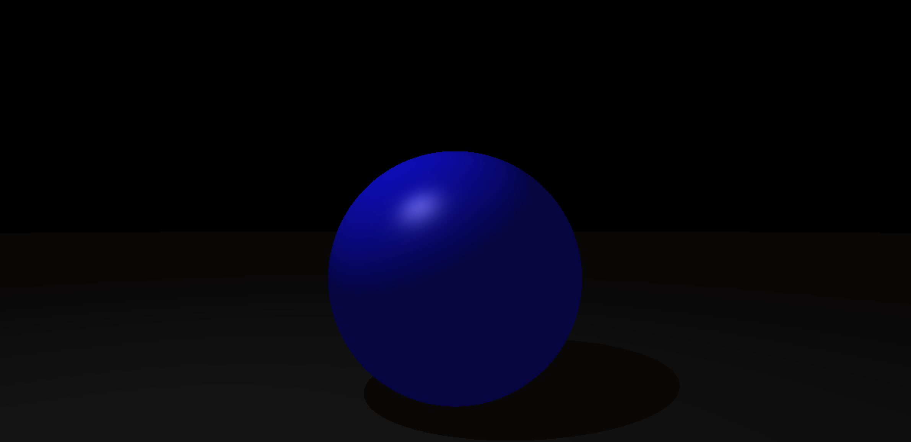
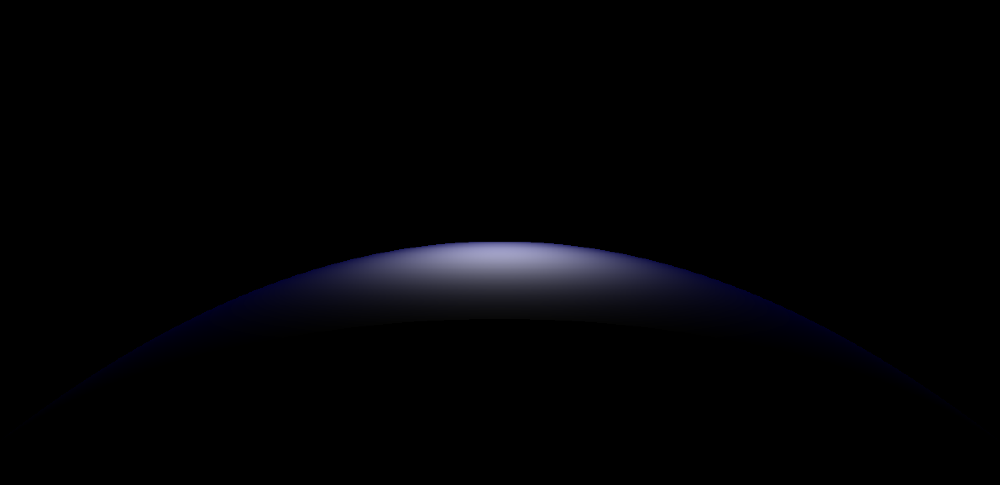
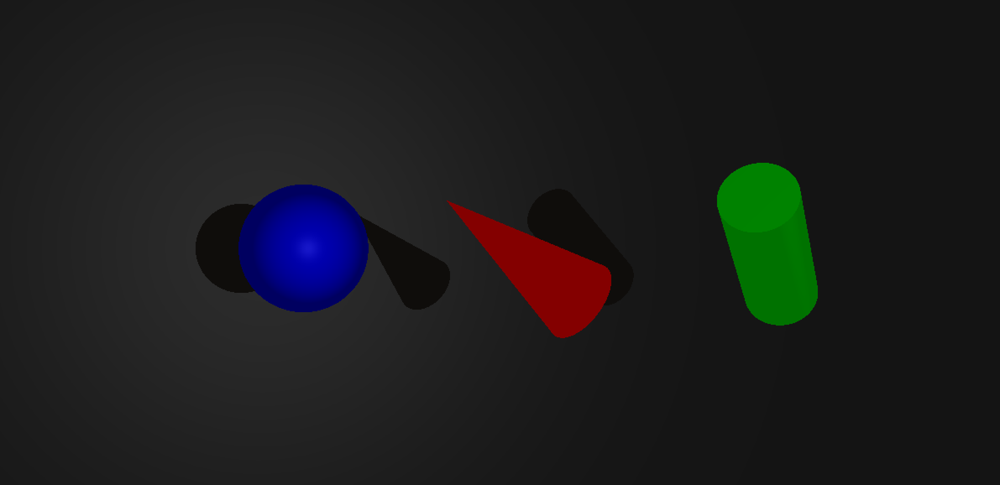

# Ray Tracer

A ray tracer built in c as part of Codam's `miniRT` project. This project renders 3D scenes using ray casting, interction tests and shading models; Lambert Reflection for diffuse shading, and Phong Reflection Model for specular reflection.

## Getting Started

### 1. Compile and Run

Compile this project using `make`, and pass a scene `.rt` file to the executable. Make with `valgrind` to check for leaks and data races.

```bash
# Run ray tracer
make && ./miniRT assets/scene_00.rt

# Run with valgrind
make valgrind-run SCENE=assets/scene_00.rt
```

### 2. Controls

Use the following keys to interactively inspect and modify objects in the scene:

**Object Selection**
- `[` — Select previous object
- `]` — Select next object

**Edit Mode**
- `tab` — Cycle to the next editable property (e.g., position, rotation, color)

**Vector Component Selection**
- `x` — Select x-axis component
- `y` — Select y-axis component
- `z` — Select z-axis component

**Property Adjustment**
- `↑` — Increase selected property value
- `↓` — Decrease selected property value

---
<br/>


## Some examples

**Figure 1** This image demonstrates the simplest case of ray-object intersection: a single sphere with ambient and diffuse shading. It verifies: Sphere intersection logic; normal calculation; basic Lambertian (diffuse) lighting. This forms the foundation for all other object and lighting interactions in the ray tracer.



<div align="center"> Figure 1: Simple sphere </div>

<br/>


**Figure 2** This scene illustrates rim lighting and shadow silhouette effects when a light is placed behind a sphere. It shows: Directional lighting accuracy; proper dot product use in `max(dot(N, L), 0)`; realistic light falloff and shadowing on the viewer-facing side. Backlighting reveals whether your surface normals and lighting calculations behave correctly from all directions.



<div align="center"> Figure 2: Backlit sphere </div>

<br/>


**Figure 3** This composite scene showcases your ray tracer's support for: All required geometric primitives; inter-object shadows; specular highlights using the Phong model; surface normal handling for curved and flat shapes. It verifies that your ray tracer can handle multiple object types together with consistent shading, depth sorting, and shadow casting.



<div align="center"> Figure 3: All primitives </div>

<br/>


## How Ray Tracing works:

The core idea: simulate rays of light from the camera and determine what they hit in the scene. Each pixel on the screen represents a ray cast into the world.

### 📐 Rays and Camera

#### 1. What is a Ray?

A ray is a mathematical model that represents a line with a starting point and a direction, extending infinitely in that direction.

In the context of ray tracing (and 3D graphics), a ray simulates a path that light might travel. It is defined by:

```math
P(t) = A + t·b
```

Where:

- `P(t)` is a point on the ray at time `t`.
- `A` is the origin of the ray (usually the camera or eye position).
- `b` is the direction vector of the ray (normalized).
- `t` is a scalar that moves the point along the ray.

This means:

- At `t = 0`, `P(t)` is the ray origin (`A`).
- As `t` increases, `P(t)` moves forward in direction `b`.
- The ray only moves forward—there is no negative `t` in most ray tracing use.

What a ray looks like:

```less
Camera (A) --> Ray direction (b)

     A ------->----------->----------->------> P(t)
             t=1         t=2         t=3
```
<div align="center"> Figure 4: Linear interpolation </div>

<br/>

#### 2. Camera Geometry and Viewport Setup

This diagram illustrates the camera coordinate system and the viewport (image plane) in my ray tracer.

- Camera Center (`●` at origin): This is the position of the camera in 3D space where all rays originate.

- Camera Axes:
	- `u` (right) — the horizontal axis pointing to the right from the camera center.
	- `v` (up) — the vertical axis pointing upwards.
	- `w` (view direction) — points forward from the camera center toward the viewport (image plane). It defines where the camera is looking.

- Viewport (image plane): The rectangular grid of pixels `[ ]` represents the viewport positioned at some distance along the `w` axis from the camera center. Each pixel on this viewport corresponds to a ray cast from the camera through that pixel into the scene.

<pre>
			v (up)
			↑
			|
			|
		Camera  |		  
		center  ● ------- → u (right)
			 \
			  \
			   \
			    ●
			    w (viewport)
	 	+---------------------+ ↑
	 	| [ ] [ ] [ ] [ ] [ ] | | Δv
	 	| [ ] [ ] [ ] [ ] [ ] | ↓
	 	| [ ] [ ] [ ] [ ] [ ] | 
	 	| [ ] [ ] [ ] [ ] [ ] |
	 	| [ ] [ ] [ ] [ ] [ ] |
	 	+---------------------+
	  	← - →
	   	  Δu
</pre>

<div align="center"> Figure 5: Camera Gemoetry & Viewport </div>

---
<br/>


### 📐 Sphere & Interception

To detect if a ray hits a sphere, solve the equation:

```math
||P(t) - C||² = r²
```

Subtracting `P(t)`:

```math
||A + t·b - C||² = r²
```

Expanding gives a qyadratic:

```math
a·t² + b·t + c = 0
```

Where:

- `a = dot(b, b)`
- `b = 2·dot(b, A - C)`
- `c = dot(A - C, A - C) - r²`

Use the discriminant `D = b² - 4ac`:

If `D < 0`: no hit
If `D = 0`: one hit (tangent)
If `D > 0`: two hits (enter and exit)

Select the smallest positive `t` for the nearest visible point.

The diagram below illustrates a ray intersecting a sphere, using a circle projected onto the viewport grid to represent the intersection.

- ● – ray hits the sphere (intersection points on the viewport)
- ◉ – ray hits the center of the sphere
- The sphere appears as a circle projection on the viewport.
- The ray from the camera origin to the center of the sphere hits at ◉, the midpoint of the projection.
- The other rays hitting the edges of the circle intersect the curved surface of the sphere at two points (enter and exit).

<pre>
 +---------------------+
 | [ ] [ ] [ ] [ ] [ ] |
 | [ ] [ ] [●] [ ] [ ] |   ← top of sphere
 | [ ] [●] [◉] [●] [ ] |   ← middle of sphere (◉ = center hit)
 | [ ] [ ] [●] [ ] [ ] |   ← bottom of sphere
 | [ ] [ ] [ ] [ ] [ ] |
 +---------------------+
            ↑
            |
           [ ] Viewport
            |
            |
            ● Camera origin
            |
            |
            ◉ Sphere center
</pre>

<div align="center"> Figure 6: Viewport interception of sphere </div>

---
<br/>


### 📐 Surface Norm and Shading

Once a ray hits a surface, we calculate the surface normal N at the point of intersection. This normal is essential for determining how light interacts with the object.

In miniRT, we use two shading models to compute the final color:

#### Diffuse Shading (Lambertian)

This simulates how rough surfaces scatter light. The brightness is proportional to the angle between the light direction `L` and the surface normal `N`. This gives objects their basic color under lighting:

```math
diffuse = kd * Il * max(dot(N, L), 0)
```

#### Specular Shading (Phong)

This simulates shiny surfaces, adding highlights when the reflection of the light vector `R` aligns with the view direction `V`.

- `α` controls the sharpness of the highlight (material shininess)
- Higher `α` means smaller, more focused highlights

```math
specular = ks * Il * pow(max(dot(R, V), 0), α)
```

To get the final pixel color, we combine:

```c
color = ka * Ia			                     // Ambient
      + kd * Il * max(dot(N, L), 0) 		 // Diffuse
      + ks * Il * pow(max(dot(R, V), 0), α)  // Specular
```

- `ka` Ambient reflection coefficient (ambient strength)
- `I` a	Ambient light intensity (usually a constant color)
- `kd` Diffuse reflection coefficient (object's base color/albedo)
- `Il` Light source intensity
- `N` Normal vector at the surface point
- `L`	Normalized vector from surface point to light source
- `dot(N, L)` Angle-based brightness (cosine of angle between N and L)
- `ks` Specular reflection coefficient (shininess strength)
- `R` Reflected light direction vector
- `V` Normalized vector from surface point to camera (viewer)
- `α` (alpha) Shininess exponent (higher = sharper highlight)

---
<br/>


### 📐 Plane and Front/Back Faces

A plane is defined by a point `P₀` and a normal `N.` For ray `P(t) = A + t·b`, the intersection is:

```math
t = dot((P₀ - A), N) / dot(b, N)
```

If the denominator `dot(b, N) ≈ 0`, the ray is parallel to the plane. For proper shading, we ensure normals point against the incoming ray. This handles backface culling and ensures consistent lighting:

```c
if (dot(ray.direction, normal) > 0)
    normal = -normal;
```

---
<br/>


### 📐 Cylinders and Cones (Bonus)

Intersection with cylinders and cones is more complex, as they are infinite by default and must be capped.

For a vertical cylinder → leads to quadratic in `t`

```math
(x² + z²) = r²
```

Similar logic applies to cones, but with a slope factor. Always check:

1. If the point lies within height bounds
2. If it intersects with end caps (if closed)

---
<br/>


### Resources

[Ray Tracer in one Weekend](https://raytracing.github.io/books/RayTracingInOneWeekend.html)